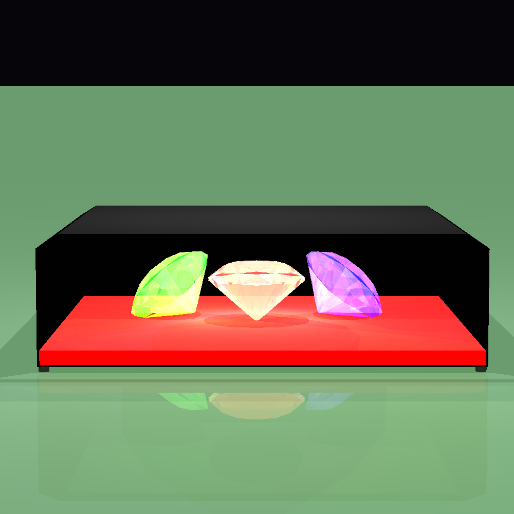

# Java 3D Ray Tracer


A powerful yet easy-to-use Java ray tracing engine. Build stunning 3D scenes using JSON, play with lights and materials, and render high-quality images in just a few lines of code.

---

## 🔍 Overview

- Create rich 3D environments: spheres, planes, triangles, cylinders, tubes, and custom polygons.
- Multiple light sources: ambient, directional, point, and spot lights for realistic shading.
- Core math utilities: vectors, points, colors, double-precision operations.
- Flexible rendering pipeline: configurable camera, pixel control, depth of field, reflection & refraction.
- JSON-driven scenes: customize objects, materials, camera, and lighting without recompiling.
- Comprehensive test suite ensures correctness and stability.

---

## ⚙️ Installation & Setup

1. **Prerequisites**: Java 11 or higher, Gradle (optional).
2. Clone the repo:
   ```sh
   git clone https://github.com/youruser/JavaRayTracer.git
   cd JavaRayTracer
   ```
3. Build & run tests:
   ```sh
   ./gradlew clean build   # runs compilation and all unit tests
   ```

---

## 🚀 Quick Start

```java
Scene scene = JsonScene.importScene("jsonScenes/house.json");
Camera camera = new Camera("house_render", 800, 600)
    .setVPSize(200, 150)
    .setVPDistance(500)
    .setRayTracer(new SimpleRayTracer(scene));

camera.renderImage()
      .writeToImage();
```

All generated images are saved under the `images/` folder by default.

---

## 📁 Project Structure

```
├── images/            # Rendered outputs and samples
├── jsonScenes/        # Example scene files
├── src/
│   ├── geometries/    # Sphere, Plane, Triangle, Cylinder, Tube, Polygon
│   ├── lighting/      # Light sources and models
│   ├── primitives/    # Point, Vector, Color, Ray, Util, Material
│   ├── renderer/      # Camera, ImageWriter, Pixel, RayTracerBase, SimpleRayTracer
│   ├── scene/         # JsonScene, Scene definitions
│   └── test/          # Main CLI demo
└── unittests/         # JUnit tests for modules
``` 

---

## 💡 Usage Examples

### Custom JSON Scene
```json
{
  "camera": { "position": [0, -200, 50], "lookAt": [0,0,0], "vpSize": [300,200], "vpDistance": 800 },
  "lights": [ { "type": "point", "position": [50,50,50], "intensity": [1,1,1] } ],
  "geometries": [ { "type": "sphere", "center": [0,0,0], "radius": 50, "material": { "kd": 0.5, "ks": 0.5, "nShininess": 100 } } ]
}
```
Load and render:
```java
Scene custom = JsonScene.importScene("jsonScenes/custom.json");
new Camera("custom_scene", 800,600)
    .setRayTracer(new SimpleRayTracer(custom))
    .renderImage()
    .writeToImage();
```

---

## 🖼️ Gallery

| Crown Scene | Multi Diamonds | House Render |
|:-----------:|:--------------:|:------------:|
|  |  |  |

| Snooker Table | Advanced Depth Test |
|:-------------:|:-------------------:|
|  |  |

**Advanced Depth Test** showcases depth of field by blurring objects outside the focal plane, creating realistic photographic effects.

## 🏗️ Architecture

- **Geometries**: define shapes implementing `Intersectable`.
- **Lighting**: light sources calculate illumination via Phong model.
- **Renderer**: `Camera` casts rays, constructs `RayTracerBase` pipeline.
- **Scene**: JSON parser builds scene graph and configures objects.
- **Testing**: JUnit validates geometry intersections, lighting, and full renders.

---

## 📈 Roadmap

- ✅ JSON scene loading
- ✅ Basic shapes and materials
- ✅ Reflection & refraction
- ✅ Depth of field and anti-aliasing
- 🔲 Soft shadows
- 🔲 Texture mapping
- 🔲 Multi-threaded rendering
- 🔲 GPU acceleration (CUDA / OpenCL)

---

## 🤝 Contributing

1. Fork the repo
2. Create a feature branch: `git checkout -b feature/YourFeature`
3. Commit your changes and push: `git commit -m "Add new feature" && git push`
4. Open a Pull Request

---

## 📄 License

MIT License © 2025

---

## ✍️ Authors
- Maor Noy (maornoy1310@gmail.com)
- Yehonatan Yeret (yeretyn@gmail.com)
