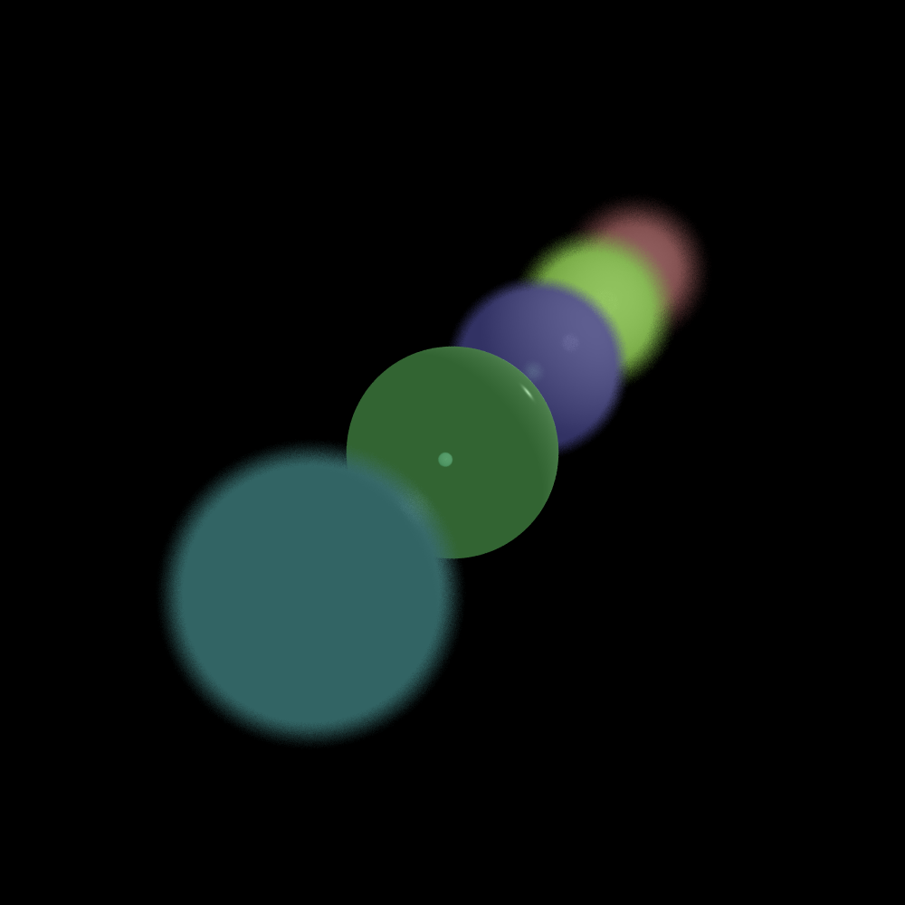
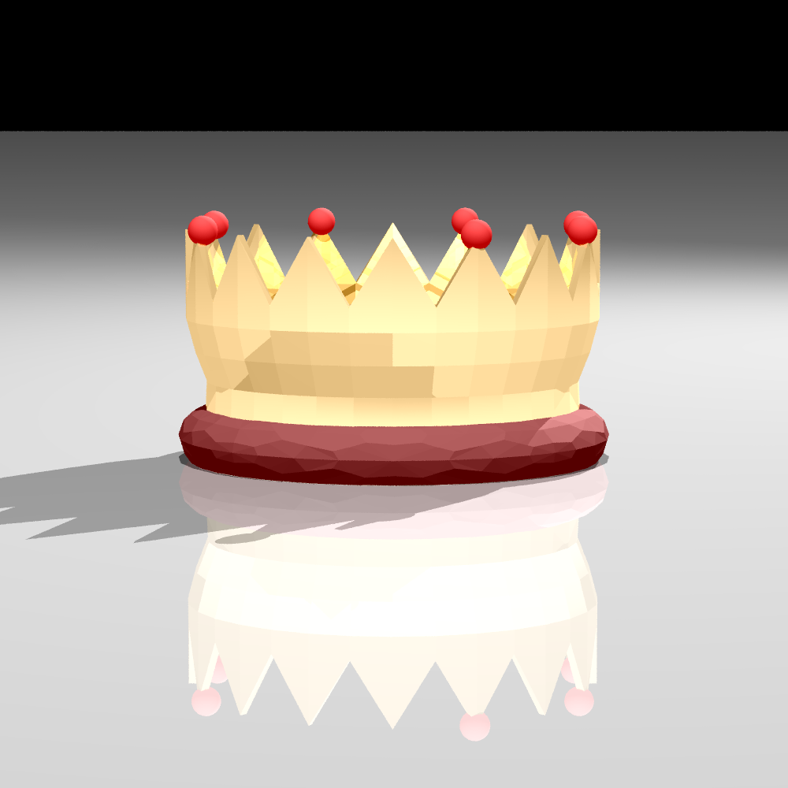
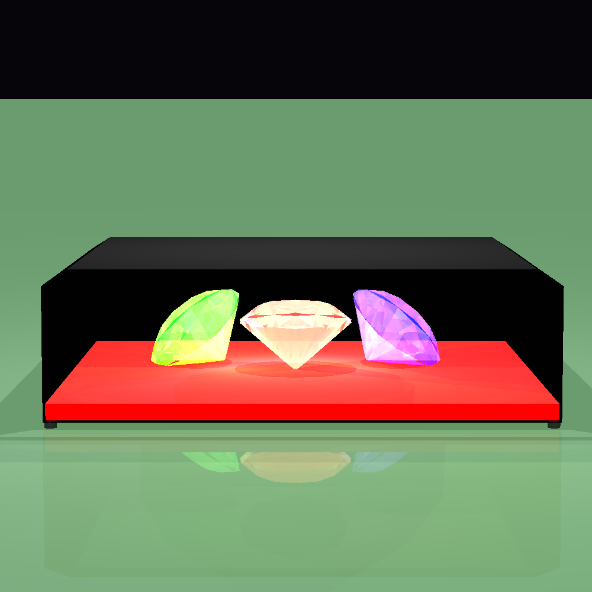
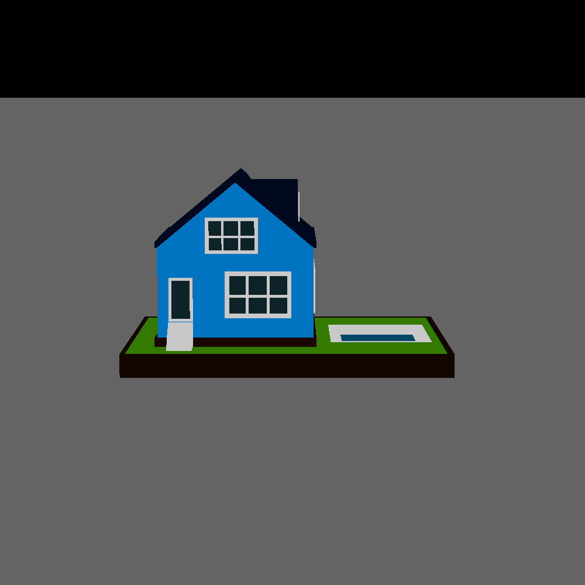
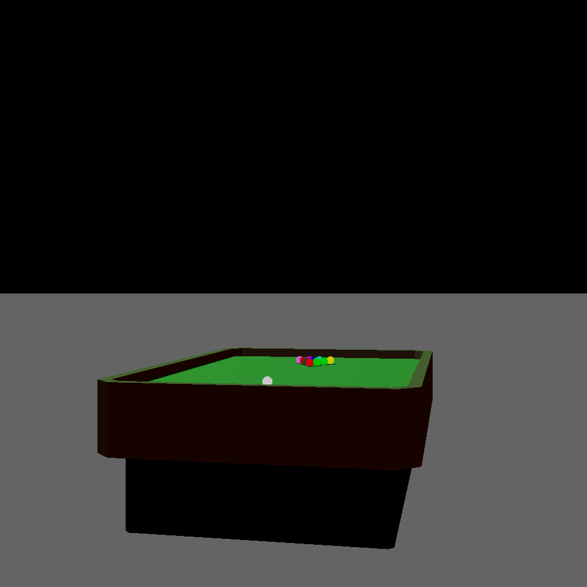

# Java 3D Ray Tracer
###### Yehonatan Yeret && Maor Noy
---



A powerful yet easy-to-use Java ray tracing engine. Build stunning 3D scenes using JSON, play with lights and materials,
and render high-quality images in just a few lines of code with a flexible and extensible architecture in SOLID rules,
with focus on efficiency and performance (Multi-threading support and more math optimizations).

---

## 🔍 Overview

- Create rich 3D environments: spheres, planes, triangles, cylinders, tubes, and custom polygons.
- Multiple light sources: ambient, directional, point, and spot lights for realistic shading.
- Core math utilities: vectors, points, colors, double-precision operations.
- Flexible rendering pipeline: configurable camera, pixel control, depth of field, reflection & refraction.
- JSON-driven scenes: customize objects, materials, camera, and lighting without recompiling.
- Comprehensive test suite ensures correctness and stability.

---

## ⚙️ Installation & Setup

1. **Prerequisites**: Java 11 or higher, Maven
2. Clone the repo:
   ```sh
   git clone https://github.com/YehonatanYeret/ISE5784_1420_8200.git
   cd unittests
   ```
3. Build & run tests:
   ```sh
    mvn clean install
    ```

---

## 🚀 Quick Start

```java
import scene.Scene;
import scene.JsonScene;
import renderer.ImageWriter;
import renderer.Camera;
import renderer.SimpleRayTracer;
import primitives.Point;
import primitives.Vector;
import org.json.simple.parser.ParseException;

import java.io.IOException;

public static void main(String[] args) throws IOException, ParseException {
    // Import scene from JSON
    Scene scene = JsonScene.importScene("jsonScenes/house.json");

    // Prepare image writer
    ImageWriter writer = new ImageWriter("house_render", 800, 600);

    // Configure camera using builder pattern
    Camera camera = Camera.getBuilder()
            .setLocation(new Point(0, -200, 50))     // camera position
            .setDirection(new Vector(0, 200, -50), new Vector(0, 1, 0)) // look-at and up vectors
            .setVpSize(200, 150)
            .setVpDistance(500)
            .setImageWriter(writer)
            .setRayTracer(new SimpleRayTracer(scene))
            .build();

    // Render and save image
    camera.renderImage()
            .writeToImage();
}
```

All generated images are saved under the `images/` folder by default.

---

## 📁 Project Structure

```
├── images/            # Rendered outputs and samples
├── jsonScenes/        # Example scene files
├── src/
│   ├── geometries/    # Sphere, Plane, Triangle, Cylinder, Tube, Polygon
│   ├── lighting/      # Light sources and models
│   ├── primitives/    # Point, Vector, Color, Ray, Util, Material
│   ├── renderer/      # Camera, ImageWriter, Pixel, RayTracerBase, SimpleRayTracer
│   ├── scene/         # JsonScene, Scene definitions
│   └── test/          # Main CLI demo
└── unittests/         # JUnit tests for modules
``` 

---

## 💡 Usage Examples

### Custom JSON Scene

```java
Scene custom = JsonScene.importScene("jsonScenes/custom.json");
// Prepare image writer
ImageWriter customWriter = new ImageWriter("custom_scene", 800, 600);
// Configure and render with builder
Camera customCamera = Camera.getBuilder()
        .setLocation(new Point(0, -200, 50))
        .setDirection(new Vector(0, 200, -50), new Vector(0, 1, 0))
        .setVpSize(300, 200)
        .setVpDistance(800)
        .setImageWriter(customWriter)
        .setRayTracer(new SimpleRayTracer(custom))
        .build()
        .renderImage()
        .writeToImage();
```

---

## 🖼️ Gallery

|        Crown Scene         |               Multi Diamonds                |        House Render        |
|:--------------------------:|:-------------------------------------------:|:--------------------------:|
|  |  |  |

|         Snooker Table          |         Advanced Depth Test         |
|:------------------------------:|:-----------------------------------:|
|  |  |

**Advanced Depth Test** showcases depth of field by blurring objects outside the focal plane, creating realistic
photographic effects.

## 🏗️ Architecture

- **Geometries**: define shapes implementing `Intersectable`.
- **Lighting**: light sources calculate illumination via Phong model.
- **Renderer**: `Camera` casts rays, constructs `RayTracerBase` pipeline.
- **Multi-threading**: configure via `Camera.Builder.setMultithreading(int)` (e.g. `-1` for auto, `0` for single-thread,
  `N` for fixed threads). Parallelizes pixel casting across cores to reduce render times on multi-core CPUs.
- **Scene**: JSON parser builds scene graph and configures objects.
- **Testing**: JUnit validates geometry intersections, lighting, and full renders.

---

## 📈 Roadmap

- ✅ Basic shapes and materials
- ✅ Reflection & refraction
- ✅ JSON scene loading
- ✅ Depth of field and anti-aliasing
- ✅ Soft shadows
- ✅ Texture mapping
- ✅ Multi-threaded rendering

---

## 🤝 Contributing

1. Fork the repo
2. Create a feature branch: `git checkout -b feature/YourFeature`
3. Commit your changes and push: `git commit -m "Add new feature" && git push`
4. Open a Pull Request

---

## ✍️ Authors

- ##### Maor Noy (github.com/maor-noy)
- ##### [Yehonatan Yeret] (github.com/YehonatanYeret)
